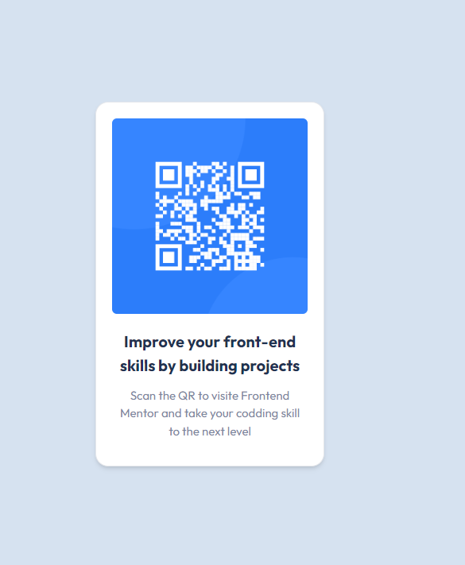

# Frontend Mentor - QR code component solution

## Table of contents

- [Overview](#overview)
  - [Screenshot](#screenshot)
  - [Links](#links)
- [My process](#my-process)
  - [Built with](#built-with)
  - [Continued development](#continued-development)
  - [Useful resources](#useful-resources)
- [Author](#author)

## Overview

### Screenshot

### Links

- Solution URL: [github](https://github.com/HlufD/qr-reader-componenet)
- Live Site URL: [netlify](https://qr-reader-componen-hluf.netlify.app/)

## My process

### Built with

- React
- TypeScript
- Tailwind CSS
- Mobile-first workflow
- [React](https://reactjs.org/) - JS library
- [react-typescript](https://react-typescript-cheatsheet.netlify.app/docs/basic/setup/)
- [tailwind css](https://tailwindcss.com/)
  `

### Continued development

i want to leanr more about layouts in css and how to work on them using talwind css and buid more components like

- Nagigations
- Cards
- Buttons
- Sidebars

## Author

- Website - [Hluf Abebe](https://www.your-site.com)
- Frontend Mentor - [@HlufD](https://www.frontendmentor.io/profile/HlufD)

## Acknowledgments
